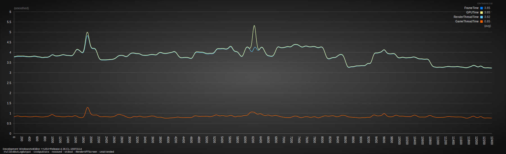

# UE4 Container Performance Profiler
## DISCLAIMER
The dockerfiles assume that you will provide a packaged UE4 project in the appropriate directory:  
For Linux: `Linux/LinuxNoEditor`  
For Windows: `Windows/WindowsNoEditor`

## TL:DR I Just Wanna Run It
For your convenience, we've provided docker images that will use CSV profiler on Epic Games' Subway Sequencer Demo.  
By default, the profiling of GPU stats is enabled with the following metrics being captured:
- FrameTime
- RenderThreadTime
- GameThreadTime
- GPUTime
- RHIThreadTime
- MemoryFreeMB
- PhysicalUsedMB
- VirtualUsedMB

### Docker Hub
https://hub.docker.com/r/belchy06/sequence_profiler
### Windows (21h1 only)
In a terminal, run:  
`docker run -it --rm --isolation=process --device class/5B45201D-F2F2-4F3B-85BB-30FF1F953599 -v d:/data/profiler/output:c:/output belchy06/sequence_profiler:windows`
### Linux
In a terminal, run:   
`docker run --rm --gpus=all -v $HOME/output:/output belchy06/sequence_profiler:linux`

## Running Multiple Containers With docker-compose
### Windows
You can run the profiler through the windows docker-compose file in a **powershell** terminal with the following command:

`$env:SOURCE="c:/Directory/For/Output/Files"; docker-compose up --scale profiler=N`

Replace the `SOURCE` value with the directory in which you want the output files to be located  
Repalce the `N` argument with the number of profilers you want to run simultaneously

### Linux
Currently the docker-compose file does not work as I am still searching for the equivalent of the docker run arg `-gpus all` for the yml file.
